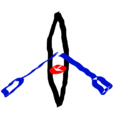

# iRow.ios
An app for rowing, with tracking and performance stats.

## History

This app has been in the app store until September 2013, with reasonable reviews.  I've taken it out
because of an issue with Apple, and because keeping it in the app store costed me money.  But it is silly to have this code, and let it go wasted.  Hence this repo.

## Features

iRow is an iPhone app that can be used in rowing.  It tracks your position, speed and strokes.  You can plot a route, and have the app automatically start and stop when you pass start and finish lines.  Great for recreational races.  There is a small database that maintains past tracks and your rowing mates---in case your rowing in a team.

The in-app help can be found [here](iRow/info.html).

## License

I license the code GPLv2.  Anybody is welcome to clone the code, build it, apply some fixes necessary for modern versions of iOS, and sell it in the app store---as long as the source is available.  It would be great if the coude is maintained here at Github. 

I hope that this leads to a price that is just enough to pay the Developer's fee to Apple---i.e., the right to sell your soul to Apple.

## Status

As of the day of upload to Github, the status is that the app works reasonably well for the iOS that was current when I stopped development---I think that was iOS 6.  I know from reports that the GPS doesn't get full accuracy from the OS anymore for newer versions of the OS---so that part probably needs some attention.  For other iOS developments, I would not know.

---david
